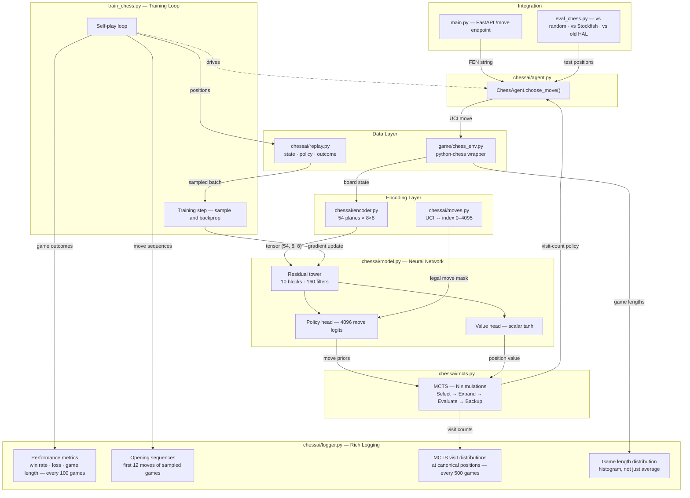

# Phase 3 Architecture — Chess with AlphaZero-Style Reinforcement Learning

**Authors:** Rob Kirkland, Ellis Ward  
**Project:** chess-ai  
**Phase:** 3 of 3  
**Status:** In progress — June 2026

---

## Overview

Phase 3 applies an AlphaZero-style approach to chess: a neural network combined
with Monte Carlo Tree Search (MCTS). This is a significant step up from the DQN
used in Phase 2. The key difference is that MCTS allows the agent to look ahead
through possible futures before choosing a move, with the neural network guiding
which futures are worth exploring.

---

## How the Three Components Interact



---

## How AlphaZero-Style Training Works

The training loop has two interleaved phases:

**Self-play:** The agent plays games against itself using MCTS to select each
move. For every position in every game, we store:
- The encoded board state
- The MCTS visit-count policy (which moves the search favoured)
- The game outcome (filled in once the game ends: +1 win, −1 loss, 0 draw)

**Training step:** Sample a batch from the replay buffer. The network predicts
(policy, value) for each position. Two losses are combined:

```
total_loss = cross_entropy(predicted_policy, mcts_policy)
           + mse(predicted_value, game_outcome)
```

The network learns to predict both *which moves the search would favour* and
*who is winning from this position.* Each generation of training data is
produced by a stronger player than the last.

---

## File Structure

```
chess-ai/
├── game/
│   └── chess_env.py          — EXISTS: python-chess environment wrapper
│
├── chessai/                  — NEW PACKAGE (named chessai to avoid
│   │                           shadowing the python-chess library)
│   ├── __init__.py
│   ├── encoder.py            — DONE: board → (55, 8, 8) tensor
│   ├── moves.py              — DONE: UCI ↔ policy index 0–4095
│   ├── model.py              — residual network, policy + value heads
│   ├── mcts.py               — tree search: select / expand / evaluate / backup
│   ├── agent.py              — wraps network + MCTS, exposes choose_move()
│   ├── replay.py             — stores (state, policy, outcome) game trajectories
│   └── logger.py             — rich strategic logging
│
├── train_chess.py            — self-play training loop
├── eval_chess.py             — evaluation vs random, Stockfish, prior HAL
└── main.py                   — EXISTS: FastAPI /move endpoint (swap one line)
```

---

## Component Specifications

### chessai/encoder.py — Board Encoding ✅

Converts a chess board (plus up to 3 previous board states for history) into
a (54, 8, 8) float tensor, always from the perspective of the player to move.
When it's black's turn, the board is mirrored vertically and piece colours
swapped so the network always sees "my pieces at the bottom."

**Plane layout:**

| Planes | Content |
|--------|---------|
| 0–47   | Piece positions — 4 history frames × 12 planes each (6 for current player's pieces + 6 for opponent's, ordered pawn/knight/bishop/rook/queen/king) |
| 48     | Current player — kingside castling right |
| 49     | Current player — queenside castling right |
| 50     | Opponent — kingside castling right |
| 51     | Opponent — queenside castling right |
| 52     | En passant target square (1 at that square, 0 elsewhere) |
| 53     | Fifty-move counter, normalised to [0, 1] |

**Note:** An earlier version included a plane 48 encoding absolute colour to
move (all 1s = white, all 0s = black). This was removed in Run 6 after it
caused a persistent black-wins bias: the network learned to correlate the
colour plane with losing rather than using it for perspective. All 54 planes
are now perspective-relative — the network has no concept of "white" or
"black", only "my pieces" and "opponent's pieces."

---

### chessai/moves.py — Move Encoding ✅

Maps any chess move to a policy index using `from_square × 64 + to_square`.
Covers all 4,096 possible (from, to) square combinations. Promotions always
default to queen (known simplification — under-promotion is rare and encoding
all promotion variants would add significant complexity for minimal benefit).

Provides `legal_move_mask(board)` — a boolean tensor of shape (4096,) used
to mask illegal moves to −∞ before argmax, same pattern as the full-column
mask in the Connect Four agent.

---

### chessai/model.py — Neural Network

Input: (54, 8, 8) tensor from encoder.py

```
Input conv:    Conv2d(54 → 160, 3×3, padding 1) + BatchNorm + ReLU
Residual ×10:  Conv2d(160 → 160, 3×3, padding 1) + BatchNorm + ReLU
               Conv2d(160 → 160, 3×3, padding 1) + BatchNorm
               + skip connection → ReLU
Policy head:   Conv2d(160 → 2, 1×1) + BatchNorm + ReLU
               → flatten → Linear(128, 4096)
Value  head:   Conv2d(160 → 1, 1×1) + BatchNorm + ReLU
               → flatten → Linear(64, 256) → Linear(256, 1) → Tanh
```

AlphaZero uses 20 residual blocks and 256 filters. We use 10 blocks and 160
filters — scaled for the MacBook Pro M5 Pro with 24GB unified memory.

BatchNorm is new relative to Phase 2 — it normalises activations between
layers, which is important for stability in deeper networks.

---

### chessai/mcts.py — Monte Carlo Tree Search

Each tree node stores: visit count N, total value W, prior probability P
(from the network), and a children dictionary keyed by move index.

The UCB formula balances exploitation (high Q) with exploration (high P,
low visit count):

```
UCB(s, a) = Q(s,a) + c_puct × P(s,a) × √N(s) / (1 + N(s,a))
```

One simulation = select leaf via UCB → expand → evaluate with network →
backpropagate value (flipping sign at each level for the two-player game).

After N simulations, return normalised visit counts as the move policy.
More visited = both network and search agree it is good.

**Key parameter:** `c_puct ≈ 1.5` (exploration constant).
**Simulations per move:** 200 during training (Run 7), 50 during evaluation.

---

### chessai/agent.py — ChessAgent

Wraps the network and MCTS. Exposes:
- `choose_move(board, history, n_simulations)` → UCI string
- `train(batch)` → gradient update step

During training: adds Dirichlet noise to root node priors (encourages
exploration of less-visited lines). During evaluation: clean MCTS, no noise.

---

### chessai/replay.py — Trajectory Buffer

Stores `(encoded_state, mcts_policy, outcome)` tuples — one per position
per game. Outcome (+1/−1/0) is filled in at game end and applied
retrospectively to all positions from that game.

Different from Phase 2's DQN replay buffer which stored individual
transitions. Here we store complete game trajectories.

**Two partitions:**
- **Rolling buffer** (50,000 positions): standard circular buffer — oldest
  entries evicted as new self-play positions arrive.
- **Permanent buffer**: ground-truth positions (canonical endgames such as
  K+Q vs K) that are never evicted. Sampled at ~12.5% of each training batch
  regardless of buffer age. Ensures the value head keeps canonical signal
  throughout the full training run, not just until the rolling buffer fills.

The permanent partition was added after observing that canonical positions
seeded into the rolling buffer would be evicted around game 800 — before
the value head had reliably learned from them.

---

### chessai/logger.py — Rich Logging

Designed to answer the questions Phase 2 logging couldn't:
*When did a specific exploit emerge? How long did it take to counter?
Did it get redeployed selectively later?*

| Log | Frequency | Purpose |
|-----|-----------|---------|
| Individual game record (outcome, end reason, moves) | Every game | Full game history, move-level analysis |
| Win rate, loss, game length | Every 50 games | Performance curve |
| Opening sequences (first 12 moves) | Every game | Detect repertoire emergence |
| MCTS visit distributions at 5 canonical positions | Every 500 games | Confidence vs exploration signal |
| Game length histogram (bucketed) | Every 50 games | Bimodal shape = selective exploit |

The opening sequence log is the key addition over Phase 2 — if the same
12-move sequence starts appearing in an increasing percentage of games,
that is a specific line being developed. When it diversifies again, that
is the opponent adapting.

---

### train_chess.py — Training Loop

Self-play games generate trajectories → buffer fills → sample batches →
train network. Logging hooks into logger.py throughout.

---

### eval_chess.py — Evaluation

| Matchup | Purpose |
|---------|---------|
| HAL vs random | Sanity check — should win nearly always |
| HAL vs Stockfish depth 1–3 | Real benchmark against a known-strength opponent |
| HAL vs previous HAL checkpoint | Measures improvement between training runs |

---

### main.py — FastAPI Integration (existing)

The `/move` endpoint already exists and accepts FEN, returns a UCI move.
Currently calls `env.random_move()`. When Phase 3 is complete, that single
line is replaced with `agent.choose_move(board, history, n_simulations)`.
No other changes to the API required.

---

## Build Order

| Step | File | Status |
|------|------|--------|
| 1 | chessai/encoder.py | ✅ Done |
| 2 | chessai/moves.py | ✅ Done |
| 3 | chessai/model.py | ✅ Done |
| 4 | chessai/mcts.py | ✅ Done |
| 5 | chessai/replay.py | ✅ Done |
| 6 | chessai/agent.py | ✅ Done |
| 7 | chessai/logger.py | ✅ Done |
| 8 | train_chess.py | ✅ Done |
| 9 | eval_chess.py | ✅ Done |
| 10 | main.py (update) | Pending — awaiting trained model |

---

---

## Training Runs

### Run 1 — MacBook Air M3 (abandoned at game 1090)

**Config:** 128 channels, 8 blocks, 50 simulations  
**Hardware:** MacBook Air M3, 16GB  
**Games completed:** 1090  
**Training steps:** 5,480  
**Final loss:** ~3.35  

**Eval at game 1090:**
- vs Random (White): 0W / 9L / 91D — 0% win rate
- vs Random (Black): 0W / 15L / 85D — 0% win rate
- vs Stockfish depth 1: 0W / 50L / 0D

**Why abandoned:** Moved to MacBook Pro M5 Pro. Scaled up model and simulations for new hardware.

---

### Run 2 — MacBook Pro M5 Pro (abandoned at game 200)

**Config:** 160 channels, 10 blocks, 100 simulations  
**Hardware:** MacBook Pro M5 Pro, 24GB  
**Games completed:** 200  
**Training steps:** 970  
**Final loss:** ~4.87  

**Eval at game 200:**
- vs Random (White): 0W / 10L / 90D — 0% win rate
- vs Random (Black): 0W / 12L / 88D — 0% win rate

**Value head regression test:**
- Start position: -0.049 (expect ~0.0) ✓ (trivially correct)
- K+Q vs K (white wins): -0.069 (expect near +1) ✗
- K+Q vs K (black to move): +0.007 (expect near -1) ✗
- White missing queen: -0.041 (expect < 0) ✗

**Why abandoned:** Draw-collapse confirmed. The value head output ~0 for all positions including trivially decisive endgames. Root cause: with 200 games all ending as cap-draws, every position in the replay buffer carries an outcome of 0. The value head MSE loss is already minimised by predicting zero everywhere — the gradient is flat and the value head learns nothing. MCTS evaluations are therefore meaningless, and the policy head is learning move frequencies rather than strategy.

**Fix for Run 3:** Lower `RESIGN_MATERIAL` and `RESIGN_CONSECUTIVE` to generate decisive games earlier in training, seeding the replay buffer with non-zero outcomes so the value head receives real gradient signal from the start.

---

### Run 3 — MacBook Pro M5 Pro (abandoned at game 400)

**Config:** 160 channels, 10 blocks, 100 simulations  
**Hardware:** MacBook Pro M5 Pro, 24GB  
**Games completed:** 400  
**Training steps:** 1,915  
**Key changes from Run 2:** `RESIGN_MATERIAL` 9 → 5, `RESIGN_CONSECUTIVE` 5 → 3

**Result:** All 400 games were cap-draws. Resign logic never fired.

**Two bugs discovered:**

**Bug 1 — resign streak never accumulates:**  
The streak checked `mat_from_mover < -RESIGN_MATERIAL`, where `mat_from_mover`
flips sign every half-move. With white down 6: white's turn → streak = 1;
black's turn → from black's perspective black is UP 6, streak resets to 0.
Alternated 1/0/1/0 indefinitely, never reaching 3.  
**Fix:** Check `abs(mat) > RESIGN_MATERIAL` — imbalance is absolute, independent of
whose turn it is. Winner at resignation determined by which side has more material.

**Bug 2 — end_reasons.csv all zeros:**  
Logger window dict used plural keys (`"cap_draws"`, `"checkmates"`) but `end_reason`
strings from the training loop are singular (`"cap_draw"`, `"checkmate"`). The
`if key in self._window` guard silently discarded every event.  
**Fix:** Renamed window keys to match the end_reason strings exactly.

**Loss curve:** 6.66 → 4.97 → 3.88 → 3.87 (flatlined last 100 games). Policy head
learned some structure; value head fully collapsed to ~0.

---

### Run 4 — MacBook Pro M5 Pro (abandoned at game 2300)

**Config:** 160 channels, 10 blocks, 100 simulations  
**Hardware:** MacBook Pro M5 Pro, 24GB  
**Games completed:** 2,300  
**Seeded from:** Run 3 checkpoint at game 400 (policy head preserved, buffer discarded)  
**Key fixes:** resign streak uses `abs(mat)`, logger keys corrected

**Results:**
- First run with resign actually firing — first win at game 2, 75 moves (material resign)
- Value head developed: value resigns appeared and grew through the run
- Loss curve: 6.26 → ~3.5 over 2,300 games (healthy decline)
- Persistent black-wins bias: 55–60% black win rate throughout, never correcting

**Eval at game 2300:**
- vs Random: 0% win rate (HAL cannot deliver checkmate yet)
- Value head regression: partial movement but still far from ±1 on canonical positions

**Root cause identified:** Encoder plane 48 (absolute colour indicator) caused
the network to learn "white to move = losing" after 2,300 games of self-play
where white made first-move errors disproportionately. The network conflated
colour with losing side.

**Why abandoned:** Colour bias structural, not trainable away. Required encoder
change.

---

### Run 5 — MacBook Pro M5 Pro (abandoned at game 100)

**Config:** 160 channels, 10 blocks, 100 simulations  
**Hardware:** MacBook Pro M5 Pro, 24GB  
**Games completed:** 100  
**Purpose:** Confirm colour bias was structural before committing to encoder change

**Result:** Black-wins bias reappeared immediately and held at ~60% through 100
games. Confirmed the bias was not a fluke of Run 4's longer training — it emerges
from the encoder structure within the first 100 games.

**Why abandoned:** Bias confirmed structural. Plane 48 removed from encoder.

---

### Run 6 — MacBook Pro M5 Pro (complete at game 5000)

**Config:** 160 channels, 10 blocks, 100 simulations, 54-plane encoder (colour-blind)  
**Hardware:** MacBook Pro M5 Pro, 24GB  
**Games completed:** 5,000  
**Training steps:** ~25,000  
**Key change:** Plane 48 (colour to move) removed from encoder. Fresh random weights.

**Results:**
- Colour bias eliminated: W/B tally balanced throughout (48–52% range)
- Loss curve: 6.26 → 3.48 over 5,000 games
- Average game length: 84 moves (game 1) → 48 moves (game 5000) — resign firing earlier as value head developed
- Value resigns: grew from 0 to ~20 per 50-game window by game 5000
- First checkmate appeared at game 658

**Eval at game 5000:**
- vs Random: 0% win rate (value head cannot yet convert to checkmate)
- White loss rate vs random: improved to 9% at game 2000, regressed to 18% by game 5000 as policy became more aggressive

**Value head regression at game 5000:**
- Start position: near zero ✓
- K+Q vs K (w wins): near zero ✗ (value head not generalising to canonical endgames)
- K+Q vs K (b move): weak negative signal ✗
- White missing queen: slightly negative ✗

**Key finding:** The value head develops during self-play but does not generalise to
canonical endgame positions it has never seen. The bootstrapping problem persists —
early self-play noise delays value head development regardless of resign thresholds.

**Data archived:** `paper/data/run6/`

---

### Run 7 — MacBook Pro M5 Pro (stopped at game 1200, 2026-06-04)

**Config:** 160 channels, 10 blocks, 200 simulations, 54-plane encoder  
**Hardware:** MacBook Pro M5 Pro, 24GB  
**Key changes from Run 6:**
- N_SIMULATIONS doubled to 200
- Seeded replay buffer: 40,646 positions from Run 6 (decisive games 3000–5000)
  + canonical endgame positions in permanent partition (never evicted)
- Fresh random weights

**Key results:**
- Loss: 1.14 → 5.27 (plateau, games 700–750) → 4.59 (game 1200, new low)
- Value resigns: peaked at 10/window (game 1150). MCTS-driven — see bug note below.
- Value head regression peak at game ~990: K+Q vs K (b move) = **-0.950** — first time any run reached near-target values
- Collapse at game ~1000: cap draw spike (11 draws) pushed all regression values to ~-0.03

**Critical discovery — MCTS backup sign bug:**
All runs 1–7 had an inverted backup. `node.W` was storing the value from the leaf
player's perspective instead of the parent's. MCTS was selecting the worst available
move every simulation. The value head learned correctly (trained from game outcomes),
but the policy head learned to prefer losing moves. This explains the persistent
0% win rate vs random across all runs. See run_notes.md for full analysis and fix.

**Why stopped early (game 1200):**
1. Value head collapsed after cap draw spike — not recovering
2. MCTS backup bug identified — full restart required with fix
3. Persistent black bias in recent windows (self-play meta)

**Data:** `logs/run7/`

---

### Run 8 — MacBook Pro M5 Pro (in progress, 2026-06-04)

**Config:** 160 channels, 10 blocks, 200 simulations, 54-plane encoder  
**Hardware:** MacBook Pro M5 Pro, 24GB  
**Key changes from Run 7:**
- **MCTS backup sign fixed** — policy head now learns correct move preferences
- **Cap draw outcome from material** — games hitting 50-move cap with abs(material) > 3 assigned ±0.8 soft outcome instead of 0.0 (prevents value head contamination)
- **Canonical partition raised 12.5% → 25%** per batch — stronger resistance to cap draw pollution
- **Seed buffer from Run 7** — 13,152 positions from decisive games 800–1200, 1,600 canonical positions in permanent partition

**Motivation:** Run 7 proved buffer seeding works (value head reached -0.950). The
backup fix means the policy head will now learn correctly for the first time. The cap
draw fix means value collapse from game 1000-style spikes should not recur.

**Status:** In progress. Game 1,440+ as of 2026-06-06.

**Results to date:**
- ~231 checkmates in 1,400 games (16% rate) — Run 6 had its first at game 658
- Loss: 1.36 → 3.84 (plateau ~game 700) → **3.26 at game 1,400** (new low, continuing to decline)
- Value resigns: stable 5–8 per 50-game window
- Cap draws: never exceeded 8 per window — cap draw fix working throughout

**Eval results:**
| Game | Steps | Win rate vs random | Notes |
|------|-------|-------------------|-------|
| 560 | 2,910 | **4%** | First wins in project history |
| 1,000 | 5,110 | **12%** | 3× improvement |
| 1,500 | 7,310 | **18%** | New high; 20% as Black |
| vs Stockfish depth 1 (200 sims, game 1500) | — | **0%** | 0 draws; HAL wins via blunders, not plans |

**Value head regression:**
- Game 560: b-move -0.603 (milestone passed)
- Game 1,200: b-move -0.620, w-wins +0.697 (best symmetric result — both correct sign)
- Game 1,420: b-move -0.838 (run high), w-wins -0.812 (sign oscillation — structural)
- Persistent asymmetry: b-move (losing side) learns reliably; w-wins (winning side) oscillates.
  Root cause: colour-blind encoder cannot distinguish "I have the queen" from "opponent has
  the queen." Fix identified for Run 9: canonical encoding (flip board for current player,
  so network always sees itself in white's position regardless of actual colour).

**Checkmate evolution:**
- Games 1–500: shortest 4 moves (Fool's Mate, game 823). Dominant: queen-to-h4/h5 opening traps.
- Games 501–1100: shortest 6 moves. Traps fading; sustained play emerging.
- Games 1101–1440: shortest 14 moves. No opening traps. Checkmates earned through play.
  W/B split reversed: white now wins more checkmates (30/24) as black-favouring traps disappeared.

---

*Architecture document — chess-ai Phase 3. Updated 2026-06-06.*
