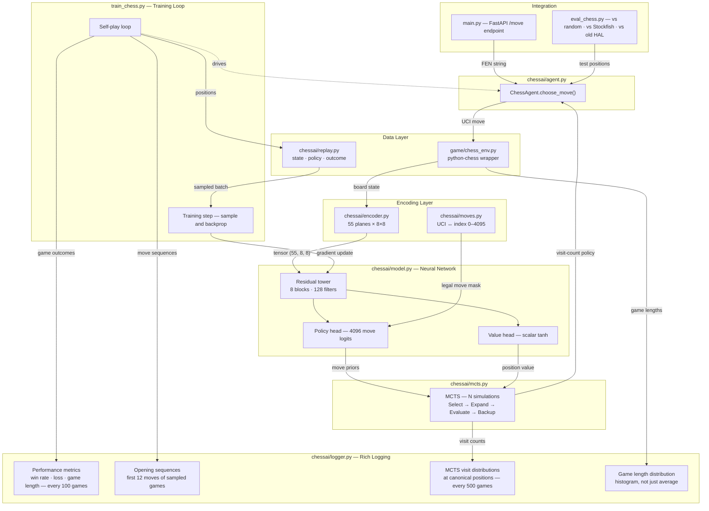

# Phase 3 Architecture — Chess with AlphaZero-Style Reinforcement Learning

**Authors:** Rob Kirkland, Ellis Ward  
**Project:** chess-ai  
**Phase:** 3 of 3  
**Status:** In progress — May 2026

---

## Overview

Phase 3 applies an AlphaZero-style approach to chess: a neural network combined
with Monte Carlo Tree Search (MCTS). This is a significant step up from the DQN
used in Phase 2. The key difference is that MCTS allows the agent to look ahead
through possible futures before choosing a move, with the neural network guiding
which futures are worth exploring.

---

## How the Three Components Interact



---

## How AlphaZero-Style Training Works

The training loop has two interleaved phases:

**Self-play:** The agent plays games against itself using MCTS to select each
move. For every position in every game, we store:
- The encoded board state
- The MCTS visit-count policy (which moves the search favoured)
- The game outcome (filled in once the game ends: +1 win, −1 loss, 0 draw)

**Training step:** Sample a batch from the replay buffer. The network predicts
(policy, value) for each position. Two losses are combined:

```
total_loss = cross_entropy(predicted_policy, mcts_policy)
           + mse(predicted_value, game_outcome)
```

The network learns to predict both *which moves the search would favour* and
*who is winning from this position.* Each generation of training data is
produced by a stronger player than the last.

---

## File Structure

```
chess-ai/
├── game/
│   └── chess_env.py          — EXISTS: python-chess environment wrapper
│
├── chessai/                  — NEW PACKAGE (named chessai to avoid
│   │                           shadowing the python-chess library)
│   ├── __init__.py
│   ├── encoder.py            — DONE: board → (55, 8, 8) tensor
│   ├── moves.py              — DONE: UCI ↔ policy index 0–4095
│   ├── model.py              — residual network, policy + value heads
│   ├── mcts.py               — tree search: select / expand / evaluate / backup
│   ├── agent.py              — wraps network + MCTS, exposes choose_move()
│   ├── replay.py             — stores (state, policy, outcome) game trajectories
│   └── logger.py             — rich strategic logging
│
├── train_chess.py            — self-play training loop
├── eval_chess.py             — evaluation vs random, Stockfish, prior HAL
└── main.py                   — EXISTS: FastAPI /move endpoint (swap one line)
```

---

## Component Specifications

### chessai/encoder.py — Board Encoding ✅

Converts a chess board (plus up to 3 previous board states for history) into
a (55, 8, 8) float tensor, always from the perspective of the player to move.
When it's black's turn, the board is mirrored vertically and piece colours
swapped so the network always sees "my pieces at the bottom."

**Plane layout:**

| Planes | Content |
|--------|---------|
| 0–47   | Piece positions — 4 history frames × 12 planes each (6 for current player's pieces + 6 for opponent's, ordered pawn/knight/bishop/rook/queen/king) |
| 48     | Colour to move in absolute terms (all 1s = white, all 0s = black) |
| 49     | Current player — kingside castling right |
| 50     | Current player — queenside castling right |
| 51     | Opponent — kingside castling right |
| 52     | Opponent — queenside castling right |
| 53     | En passant target square (1 at that square, 0 elsewhere) |
| 54     | Fifty-move counter, normalised to [0, 1] |

---

### chessai/moves.py — Move Encoding ✅

Maps any chess move to a policy index using `from_square × 64 + to_square`.
Covers all 4,096 possible (from, to) square combinations. Promotions always
default to queen (known simplification — under-promotion is rare and encoding
all promotion variants would add significant complexity for minimal benefit).

Provides `legal_move_mask(board)` — a boolean tensor of shape (4096,) used
to mask illegal moves to −∞ before argmax, same pattern as the full-column
mask in the Connect Four agent.

---

### chessai/model.py — Neural Network

Input: (55, 8, 8) tensor from encoder.py

```
Input conv:    Conv2d(55 → 128, 3×3, padding 1) + BatchNorm + ReLU
Residual ×8:   Conv2d(128 → 128, 3×3, padding 1) + BatchNorm + ReLU
               Conv2d(128 → 128, 3×3, padding 1) + BatchNorm
               + skip connection → ReLU
Policy head:   Conv2d(128 → 2, 1×1) + BatchNorm + ReLU
               → flatten → Linear(128, 4096)
Value  head:   Conv2d(128 → 1, 1×1) + BatchNorm + ReLU
               → flatten → Linear(64, 256) → Linear(256, 1) → Tanh
```

AlphaZero uses 20 residual blocks and 256 filters. We use 8 blocks and 128
filters — scaled for the MacBook Air M3. Can be increased when training
moves to the Windows desktop.

BatchNorm is new relative to Phase 2 — it normalises activations between
layers, which is important for stability in deeper networks.

---

### chessai/mcts.py — Monte Carlo Tree Search

Each tree node stores: visit count N, total value W, prior probability P
(from the network), and a children dictionary keyed by move index.

The UCB formula balances exploitation (high Q) with exploration (high P,
low visit count):

```
UCB(s, a) = Q(s,a) + c_puct × P(s,a) × √N(s) / (1 + N(s,a))
```

One simulation = select leaf via UCB → expand → evaluate with network →
backpropagate value (flipping sign at each level for the two-player game).

After N simulations, return normalised visit counts as the move policy.
More visited = both network and search agree it is good.

**Key parameter:** `c_puct ≈ 1.5` (exploration constant — to be tuned).
**Simulations per move:** 200–400 during training, 400–800 during evaluation.

---

### chessai/agent.py — ChessAgent

Wraps the network and MCTS. Exposes:
- `choose_move(board, history, n_simulations)` → UCI string
- `train(batch)` → gradient update step

During training: adds Dirichlet noise to root node priors (encourages
exploration of less-visited lines). During evaluation: clean MCTS, no noise.

---

### chessai/replay.py — Trajectory Buffer

Stores `(encoded_state, mcts_policy, outcome)` tuples — one per position
per game. Outcome (+1/−1/0) is filled in at game end and applied
retrospectively to all positions from that game.

Different from Phase 2's DQN replay buffer which stored individual
transitions. Here we store complete game trajectories.
Capacity: ~50,000 positions.

---

### chessai/logger.py — Rich Logging

Designed to answer the questions Phase 2 logging couldn't:
*When did a specific exploit emerge? How long did it take to counter?
Did it get redeployed selectively later?*

| Log | Frequency | Purpose |
|-----|-----------|---------|
| Win rate, loss, game length | Every 100 games | Performance curve |
| Opening sequences (first 12 moves) | Every sampled game | Detect repertoire emergence |
| MCTS visit distributions at 5 canonical positions | Every 500 games | Confidence vs exploration signal |
| Game length histogram (bucketed) | Every 100 games | Bimodal shape = selective exploit |

The opening sequence log is the key addition over Phase 2 — if the same
12-move sequence starts appearing in an increasing percentage of games,
that is a specific line being developed. When it diversifies again, that
is the opponent adapting.

---

### train_chess.py — Training Loop

Self-play games generate trajectories → buffer fills → sample batches →
train network. Logging hooks into logger.py throughout.

---

### eval_chess.py — Evaluation

| Matchup | Purpose |
|---------|---------|
| HAL vs random | Sanity check — should win nearly always |
| HAL vs Stockfish depth 1–3 | Real benchmark against a known-strength opponent |
| HAL vs previous HAL checkpoint | Measures improvement between training runs |

---

### main.py — FastAPI Integration (existing)

The `/move` endpoint already exists and accepts FEN, returns a UCI move.
Currently calls `env.random_move()`. When Phase 3 is complete, that single
line is replaced with `agent.choose_move(board, history, n_simulations)`.
No other changes to the API required.

---

## Build Order

| Step | File | Status |
|------|------|--------|
| 1 | chessai/encoder.py | ✅ Done |
| 2 | chessai/moves.py | ✅ Done |
| 3 | chessai/model.py | ✅ Done |
| 4 | chessai/mcts.py | — |
| 5 | chessai/replay.py | — |
| 6 | chessai/agent.py | — |
| 7 | chessai/logger.py | — |
| 8 | train_chess.py | — |
| 9 | eval_chess.py | — |
| 10 | main.py (update) | — |

**First milestone:** HAL playing legal chess using MCTS with an untrained
(random-weight) network. Random play but correct tree search — proof the
plumbing works before training begins.

---

---

## Training Runs

### Run 1 — MacBook Air M3 (abandoned at game 1090)

**Config:** 128 channels, 8 blocks, 50 simulations  
**Hardware:** MacBook Air M3, 16GB  
**Games completed:** 1090  
**Training steps:** 5,480  
**Final loss:** ~3.35  

**Eval at game 1090:**
- vs Random (White): 0W / 9L / 91D — 0% win rate
- vs Random (Black): 0W / 15L / 85D — 0% win rate
- vs Stockfish depth 1: 0W / 50L / 0D

**Why abandoned:** Moved to MacBook Pro M5 Pro. Scaled up model and simulations for new hardware.

---

### Run 2 — MacBook Pro M5 Pro (abandoned at game 200)

**Config:** 160 channels, 10 blocks, 100 simulations  
**Hardware:** MacBook Pro M5 Pro, 24GB  
**Games completed:** 200  
**Training steps:** 970  
**Final loss:** ~4.87  

**Eval at game 200:**
- vs Random (White): 0W / 10L / 90D — 0% win rate
- vs Random (Black): 0W / 12L / 88D — 0% win rate

**Value head regression test:**
- Start position: -0.049 (expect ~0.0) ✓ (trivially correct)
- K+Q vs K (white wins): -0.069 (expect near +1) ✗
- K+Q vs K (black to move): +0.007 (expect near -1) ✗
- White missing queen: -0.041 (expect < 0) ✗

**Why abandoned:** Draw-collapse confirmed. The value head output ~0 for all positions including trivially decisive endgames. Root cause: with 200 games all ending as cap-draws, every position in the replay buffer carries an outcome of 0. The value head MSE loss is already minimised by predicting zero everywhere — the gradient is flat and the value head learns nothing. MCTS evaluations are therefore meaningless, and the policy head is learning move frequencies rather than strategy.

**Fix for Run 3:** Lower `RESIGN_MATERIAL` and `RESIGN_CONSECUTIVE` to generate decisive games earlier in training, seeding the replay buffer with non-zero outcomes so the value head receives real gradient signal from the start.

---

### Run 3 — MacBook Pro M5 Pro (in progress)

**Config:** 160 channels, 10 blocks, 100 simulations  
**Hardware:** MacBook Pro M5 Pro, 24GB  
**Key changes from Run 2:**
- `RESIGN_MATERIAL` lowered from 9 → 5 (rook rather than queen) — triggers decisive games earlier
- `RESIGN_CONSECUTIVE` lowered from 5 → 3 — resignation fires faster once condition is met
- Goal: seed replay buffer with non-zero outcomes from the start so value head receives real gradient signal

---

*Architecture document — chess-ai Phase 3. Updated as build progresses.*
